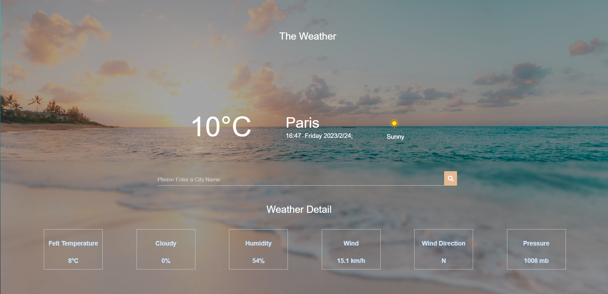
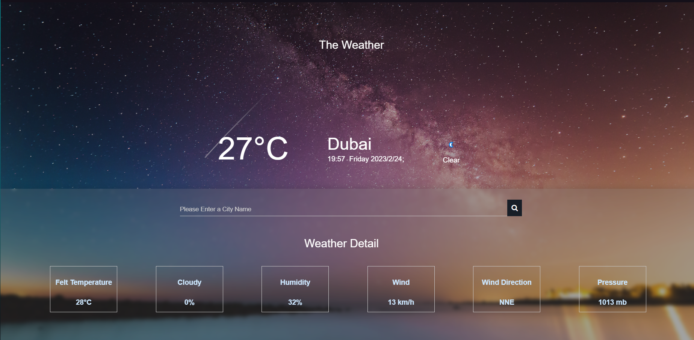
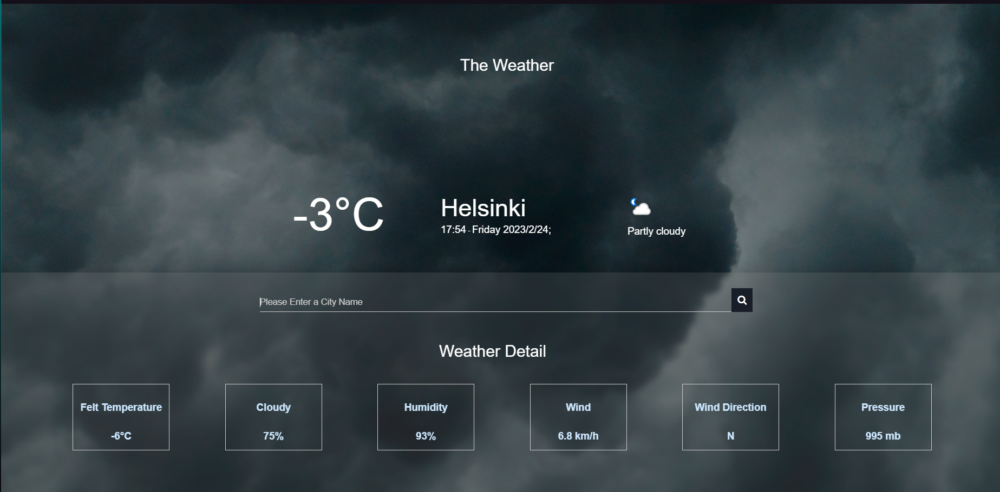
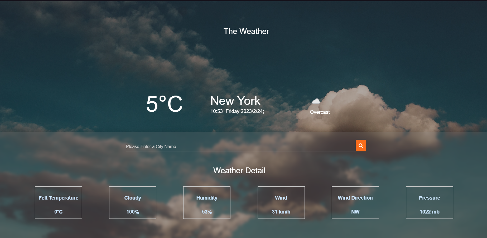
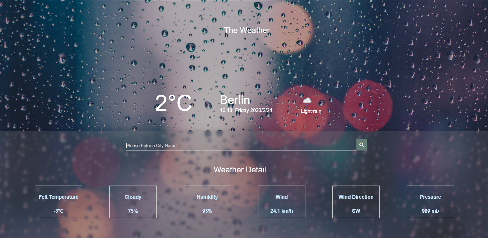

# Advanced Weather Web App

## Purpose of The Project

This project basically aims to make a weather application that gets correct data from a weather API using HTML, CSS and JavaScript.

## Used Technologies and WebSites

Html,CSS,JavaScript, [Weather API] (https://www.weatherapi.com)

## Screenshots

